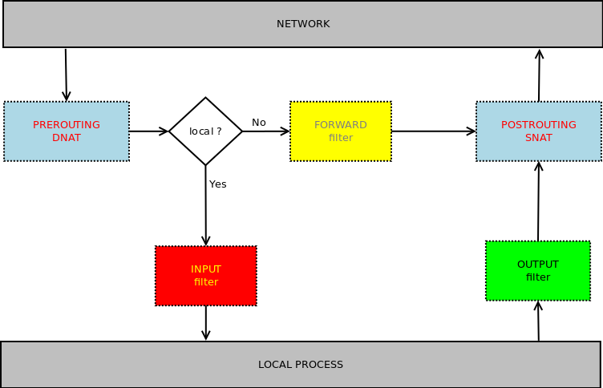

# 202

Neste arquivo contém anotações feitas durantes estudos para a prova 202 da LPI.

---

## Tópicos da prova e pesos
| Tópico | Assunto | Peso |
| --- | --- | --- |
| 207 | Domain Name Server | 8 |
| 208 | Web Services | 11 |
| 209 | File Sharing | 8 |
| 210 | Network Client Management | 11 |
| 211 | E-Mail Services | 8 |
| 212 | System Security | 14 |
---


## Anotações

### Topic 207: Domain Name Server - Weight 8
#### 207.1 Basic DNS server configuration - Weight: 3


#### 207.2 Create and maintain DNS zones - Weight: 3
#### 207.3 Securing a DNS server - Weight: 2

---

### Topic 208: Web Services - Weight 11
#### 208.1 Implementing a web server - Weight: 4
#### 208.2 Apache configuration for HTTPS - Weight: 3
#### 208.3 Implementing a proxy server - Weight: 2
#### 208.4 Implementing Nginx as a web server and a reverse proxy - Weight: 2

---

### Topic 209: File Sharing - Weight 8
#### 209.1 SAMBA Server Configuration - Weight: 5
#### 209.2 NFS Server Configuration - Weight: 3

---

### Topic 210: Network Client Management - Weight 11
#### 210.1 DHCP configuration - Weight: 2
#### 210.2 PAM authentication - Weight: 3
#### 210.3 LDAP client usage Weight: 2
#### 210.4 Configuring an OpenLDAP server - Weight: 4

---

### Topic 211: E-Mail Services - Weight 8
#### 211.1 Using e-mail servers - Weight: 4
#### 211.2 Managing E-Mail Delivery - Weight: 2
#### 211.3 Managing Remote E-Mail Delivery - Weight: 2

---

### Topic 212: System Security - Weight 14
#### 212.1 Configuring a router - Weight: 3
##### Habilitar o roteamento dos pacotes
``` bash
# adicionar rota usando comando route
route add -net $REDE gw $IP-GW

# IPv4
echo '1' > /proc/sys/net/ipv4/ip_forward

# IPv6
echo '1' > /proc/sys/net/ipv6/conf/all/forwarding
```

##### IPTables

O netfilter é o recurso do kernel que realiza o tratamento de pacotes na máquina. O IPTables é a ferramenta que administra o netfilter. O netfilter trabalha com tabelas.
* **filter**: Tabela padrão. Ela é quem filtra os pacotes.
* **nat**: Manipula pacotes que estão trafegando na máquina.
* **mangle**: Realiza alterações nos pacotes

As chains são os fluxos que o pacote pode passar na máquina:
* **INPUT**: Pacotes que estão entrando
* **OUTPUT**: Pacotes que estão saindo
* **FORWARD**: Pacotes que estão sendo encaminhados para outro host
* **PREROUTING**: Faz o pré roteamento do pacote, se o pacote não for para o servidor, ele é jogado para chain forward
* **POSTROUTING**: Pacotes sendo enviados a uma rede remota



#### 212.2 Securing FTP servers - Weight: 2
#### 212.3 Secure shell (SSH) - Weight: 4
#### 212.4 Security tasks - Weight: 3
#### 212.5 OpenVPN - Weight: 2
